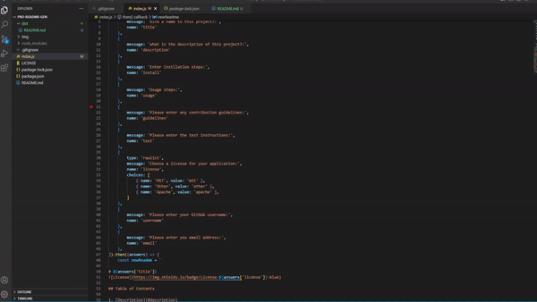

# pro-readme-gen

    
## Table of Contents
    
1. [Description](#description)
2. [Image](#Image)
    
## Description
 This is an application that uses Node.js to generate a professional README.md file that is generated by user input responses by questions. It uses node.js as well as Javscript.
    

    

## Image

    
## Luis Alicea
   
- [Repo](https://github.com/Undrcver/pro-readme-gen) 
- [Live demo](https://www.youtube.com/watch?v=zqcNQgdFSZ8)
- [GitHub](https://github.com/Undrcver)
- Email: loualicea@hotmail.com
